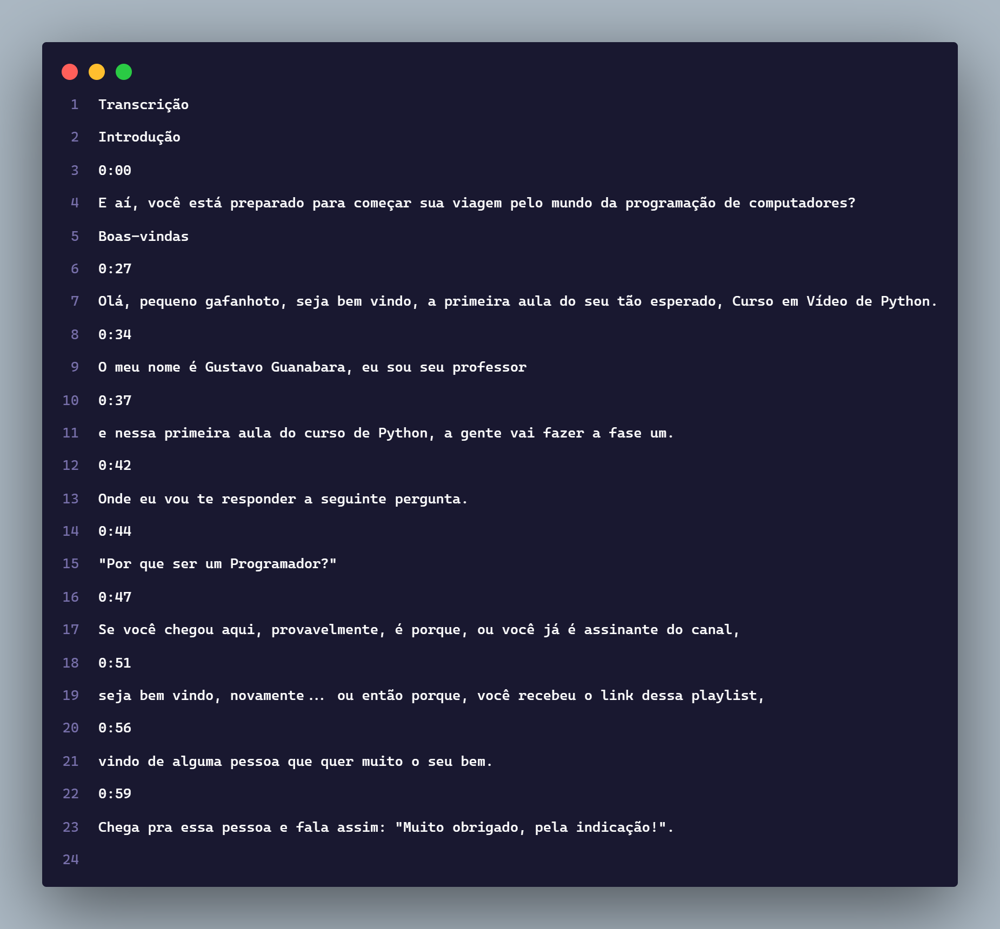

# 📜 transcript-youtube-video

---


## 📑 Sumário

* [📜 O que é](#-o-que-é-)
* [🧰 Pré-requisitos](#-pré-requisitos)
* [🚀 Como utilizar](#-como-utilizar-)
* [📂 Estrutura do Projeto](#-estrutura-do-projeto)
* [📄 Exemplo de saída](#-exemplos-de-saída)
* [⚠️ Aviso](#️-aviso-)

---

## 📜 O que é? 🤷🏻

**`transcript-youtube-video`** é um bot em Python que coleta automaticamente a **transcrição de vídeos do YouTube** e salva o conteúdo em um arquivo `.txt`.

Ele utiliza o navegador automatizado **Playwright** para abrir o vídeo, localizar a transcrição e exportá-la — tudo isso com apenas **um comando**.

---

## 🧰 Pré-requisitos

Antes de começar, certifique-se de ter os seguintes itens instalados no seu sistema:

* [Python 3.8+](https://www.python.org/downloads/)
* [Git](https://git-scm.com/)
* [Playwright](https://playwright.dev/python/)

---

## 🚀 Como utilizar

### 1. Verifique se o Git está instalado

```bash
git -v
```

Se a saída for algo como `"git version 2.x.x"`, você está pronto para continuar.

---

### 2. Clone o repositório

```bash
git clone https://github.com/flameastro/transcript-youtube-video.git
```

---

### 3. Instale as dependências

```bash
pip install playwright
playwright install
```

---

### 4. Execute o bot

Dentro da pasta do projeto, rode:

```bash
python main.py
```

O programa pedirá um **link do vídeo do YouTube**:

```
Insira a URL do vídeo do YouTube:
>>> https://www.youtube.com/watch?v=FdePtO5JSd0
```

E também perguntará se você deseja adicionar tempo ou não no arquivo `transcript.txt`. O tempo sinaliza qual é a parte do vídeo que aquele determinado texto está. (Você pode entender isso melhor comparando um [arquivo que possui tempo](assets/transcript-v1.png) e outro [arquivo que não possui tempo](assets/transcript-v2.png))

```
Deseja coletar o tempo também? [s/n]:
>>> s
```

Após inserir, uma nova janela do navegador **Chromium** será aberta automaticamente.
Basta **aguardar alguns segundos** enquanto o bot coleta a transcrição.

Se tudo correr bem ✅, a transcrição será salva no arquivo `transcript.txt`.

---

## 📂 Estrutura do Projeto

```
transcript-youtube-video/
├─ assets/
│  ├─ code.png
│  ├─ transcript-v1.png
│  └─ transcript-v2.png
├─ examples/
│  ├─ transcript-v1.txt
│  └─ transcript-v2.txt
├─ LICENSE
├─ main.py
├─ README.md
└─ transcript.txt   # gerado automaticamente após a execução
```

---

## 📄 Exemplos de saída



---

## ⚠️ Aviso

* Alguns vídeos **não possuem transcrição**, principalmente quando:

  * São **músicas** ou clipes
  * Possuem **pouco ou nenhum áudio**
  * O autor desativou as **legendas automáticas**

Nesses casos, o arquivo `transcript.txt` pode ficar vazio.

---
