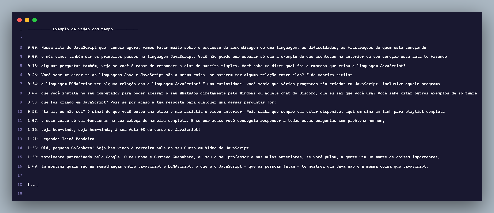
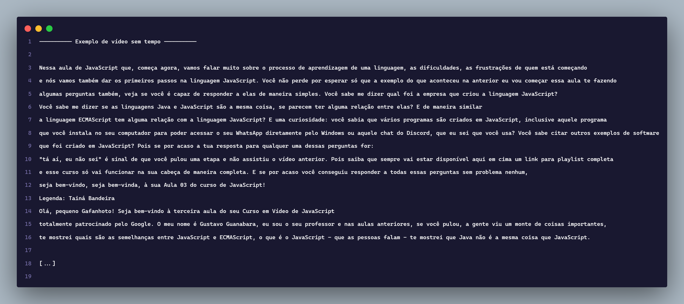

# 📜 transcript-youtube-video

##  English Version


## 📑 Table of Contents

* [📜 What is it?](#-what-is-it)
* [🧰 Requirements](#-requirements)
* [🚀 How to Use](#-how-to-use)
* [📂 Project Structure](#-project-structure)
* [📄 Output Examples](#-output-examples)
* [⚠️ Warning](#️-warning)

---

## 📜 What is it? 🤷🏻

**`transcript-youtube-video`** is a Python bot that automatically collects **YouTube video transcripts** and saves the content into a `.txt` file.

It uses the automated browser **Playwright** to open the video, access the transcript, and export it — all with just **one command**.

---

## 🧰 Requirements

Before starting, make sure the following tools are installed on your system:

* [Python 3.8+](https://www.python.org/downloads/)
* [Git](https://git-scm.com/)
* [Playwright](https://playwright.dev/python/)

---

## 🚀 How to Use

### 1. Check if Git is installed

```bash
git -v
````

If the output looks like `"git version 2.x.x"`, you're good to go.

---

### 2. Clone the repository

```bash
git clone https://github.com/flameastro/transcript-youtube-video.git
```

---

### 3. Install dependencies

```bash
pip install playwright
playwright install
```

---

### 4. Run the bot

Inside the project folder, run:

```bash
python main.py
```

The program will ask for a **YouTube video link**:

> ⚠️ Note: In the example below, I'm using a link from Gustavo Guanabara's course just for testing.

```
Enter the YouTube video URL:
>>> https://www.youtube.com/watch?v=FdePtO5JSd0
```

It will also ask if you want to include timestamps in the `transcript.txt` file.
(Timestamps indicate where in the video each piece of text appears. You can better understand this by comparing a
[file **with** timestamps](assets/transcript-v1.png) and another
[file **without** timestamps](assets/transcript-v2.png))

```
Do you want to collect timestamps as well? [y/n]:
>>> y
```

After that, a **Chromium** browser window will open automatically.
Just **wait a few seconds** while the bot collects the transcript.

If everything goes well ✅, the transcript will be saved in the `transcript.txt` file.

---

## 📂 Project Structure

```
transcript-youtube-video/
├─ assets/
│  ├─ code.png
│  ├─ transcript-v1.png
│  └─ transcript-v2.png
├─ examples/
│  ├─ transcript-v1.txt
│  └─ transcript-v2.txt
├─ LICENSE
├─ main.py
├─ README.md
└─ transcript.txt   # automatically generated after execution
```

---

## 📄 Output Examples

> Example with timestamps
>
> 

> Example without timestamps
>
> 

---

## ⚠️ Warning

* Some videos **do not have a transcript**, especially when:

  * They are **music videos**
  * They have **little or no audio**
  * The creator disabled **automatic captions**

In these cases, the `transcript.txt` file may be empty.

---


##  Versão em Português


## 📑 Sumário

* [📜 O que é](#-o-que-é-)
* [🧰 Pré-requisitos](#-pré-requisitos)
* [🚀 Como utilizar](#-como-utilizar-)
* [📂 Estrutura do Projeto](#-estrutura-do-projeto)
* [📄 Exemplo de saída](#-exemplos-de-saída)
* [⚠️ Aviso](#️-aviso-)

---

## 📜 O que é? 🤷🏻

**`transcript-youtube-video`** é um bot em Python que coleta automaticamente a **transcrição de vídeos do YouTube** e salva o conteúdo em um arquivo `.txt`.

Ele utiliza o navegador automatizado **Playwright** para abrir o vídeo, localizar a transcrição e exportá-la — tudo isso com apenas **um comando**.

---

## 🧰 Pré-requisitos

Antes de começar, certifique-se de ter os seguintes itens instalados no seu sistema:

* [Python 3.8+](https://www.python.org/downloads/)
* [Git](https://git-scm.com/)
* [Playwright](https://playwright.dev/python/)

---

## 🚀 Como utilizar

### 1. Verifique se o Git está instalado

```bash
git -v
```

Se a saída for algo como `"git version 2.x.x"`, você está pronto para continuar.

---

### 2. Clone o repositório

```bash
git clone https://github.com/flameastro/transcript-youtube-video.git
```

---

### 3. Instale as dependências

```bash
pip install playwright
playwright install
```

---

### 4. Execute o bot

Dentro da pasta do projeto, rode:

```bash
python main.py
```

O programa pedirá um **link do vídeo do YouTube**:
> ⚠️ Aviso: Neste exemplo, estou usando o link do curso do Gustavo Guanabara. Apenas para fins de testes.

```
Insira a URL do vídeo do YouTube:
>>> https://www.youtube.com/watch?v=FdePtO5JSd0
```

E também perguntará se você deseja adicionar tempo ou não no arquivo `transcript.txt`. O tempo sinaliza qual é a parte do vídeo que aquele determinado texto está. (Você pode entender isso melhor comparando um [arquivo que possui tempo](assets/transcript-v1.png) e outro [arquivo que não possui tempo](assets/transcript-v2.png))

```
Deseja coletar o tempo também? [s/n]:
>>> s
```

Após inserir, uma nova janela do navegador **Chromium** será aberta automaticamente.
Basta **aguardar alguns segundos** enquanto o bot coleta a transcrição.

Se tudo correr bem ✅, a transcrição será salva no arquivo `transcript.txt`.

---

## 📂 Estrutura do Projeto

```
transcript-youtube-video/
├─ assets/
│  ├─ code.png
│  ├─ transcript-v1.png
│  └─ transcript-v2.png
├─ examples/
│  ├─ transcript-v1.txt
│  └─ transcript-v2.txt
├─ LICENSE
├─ main.py
├─ README.md
└─ transcript.txt   # gerado automaticamente após a execução
```

---

## 📄 Exemplos de saída

> Um exemplo de saída com tempo


> Um exemplo de saída sem tempo


---

## ⚠️ Aviso

* Alguns vídeos **não possuem transcrição**, principalmente quando:

  * São **músicas** ou clipes
  * Possuem **pouco ou nenhum áudio**
  * O autor desativou as **legendas automáticas**

Nesses casos, o arquivo `transcript.txt` pode ficar vazio.

---
