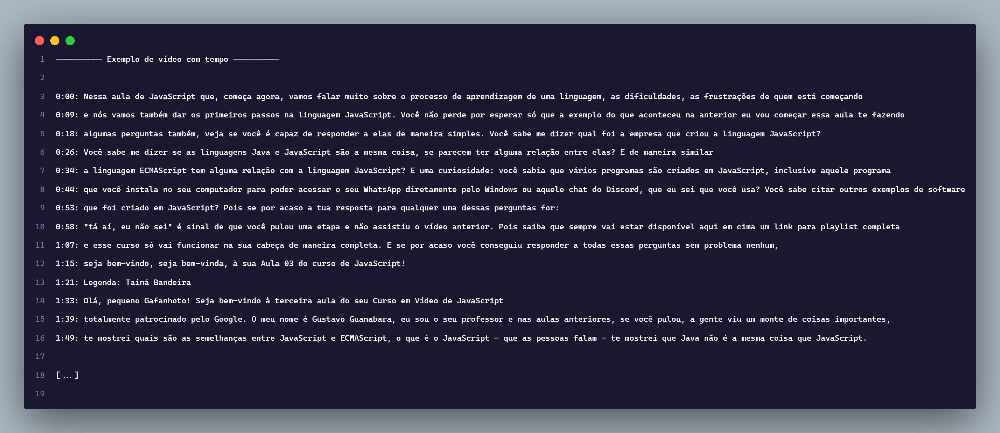
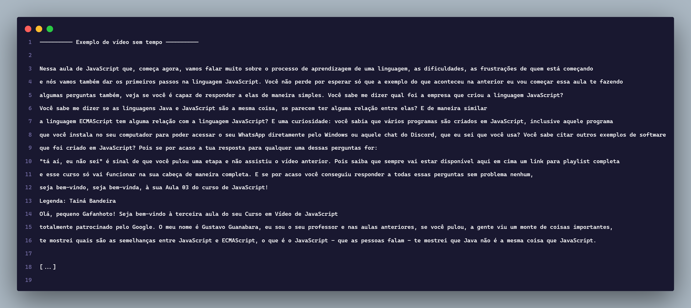

# <div align="center">


# 📜 transcript-youtube-video

Extract transcripts (subtitles) from YouTube videos in seconds

Supports timestamps • Saves to `transcript.txt` • Simple CLI

<!-- Replace this image with a GIF of the project -->

<p align="center">
  
</p>

</div>

---

## ✨ Features

* 📜 Extract subtitles from YouTube videos
* ⏱️ Optional timestamps
* 📄 Saves the transcript to a `.txt` file
* ⚡ Fast and easy to use
* 🐍 Written in Python

---

## 🚀 Quick Start

Clone the repository:

```bash
git clone https://github.com/flameastro/transcript-youtube-video.git
cd transcript-youtube-video
```

Install the dependencies:

```bash
pip install playwright
playwright install
```

Run the project:

```bash
python main.py
```

If that doesn't work:

```bash
python3 main.py
```

---

## 💻 Example

After running the program:

```text
Paste the YouTube URL:
>>> https://youtu.be/xxxxxxxx

Include timestamps? (y/n):
>>> y
```

The program creates:

```text
transcript.txt
```

Example output:

```text
00:00 Welcome back everyone!

00:07 Today we're going to...

00:15 Let's get started...
```

---

## 📸 Screenshots

### With timestamps

<p align="center">

</p>

### Without timestamps

<p align="center">

</p>

---

## ⚠️ Limitations

The generated file may be empty if:

* The video has no subtitles.
* The creator disabled captions.
* The video contains very little speech.
* The video is extremely long.

---

## 📦 Requirements

* Python 3.10+
* Git
* Playwright

---

## 🤝 Contributing

Contributions are welcome!

If you have an idea for an improvement, feel free to open an Issue or submit a Pull Request.

---

## ⭐ Support

If this project helped you, consider giving it a ⭐ on GitHub.

It helps more people discover the project.

---

## 📄 License

This project is licensed under the MIT License.
